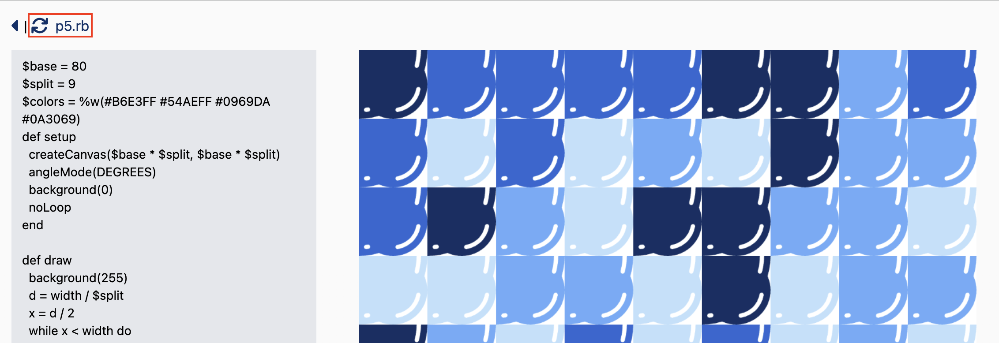

## p5.rbで作った作品置場

https://ksbmyk.github.io/sketch/

詳細画面でPCからの場合のみ表示される🔄を押すとp5.rbでの描画になります。再度🔄を押すとp5.rbを再実行します


## ローカル環境

- サーバー立ち上げ
  ```
  npm run dev
  ```
- 静的ページエクスポート
  ```
  npm run build
  ```

## 参考
- p5.js
  - [オンラインエディタ](https://p5rb.ongaeshi.me/editor/)
  - [詳しい仕組み](https://ongaeshi.hatenablog.com/entry/2023/03/10/021113)